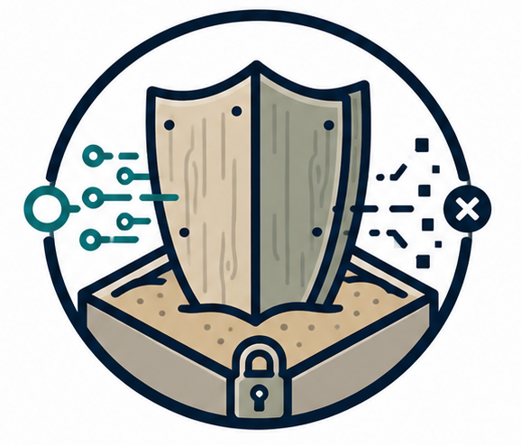
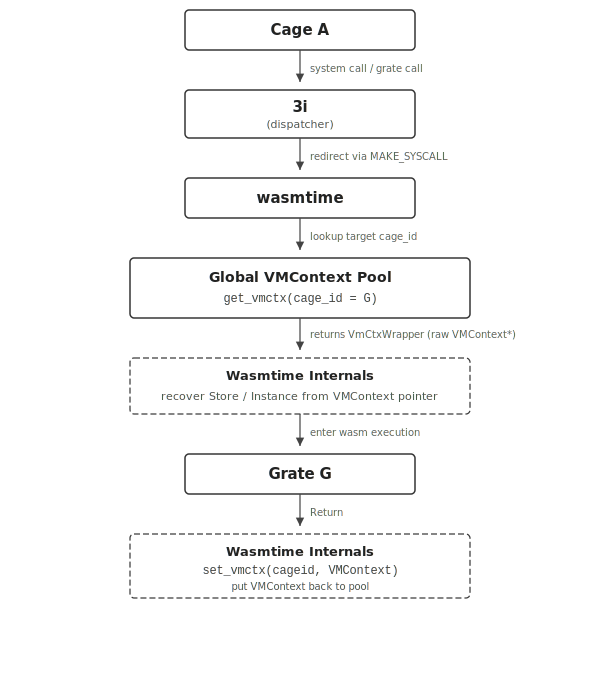

<section class="lw-hero">
  

    

      
      Lind-Wasm
    

    <h1>POSIX-style isolation, rebuilt for WebAssembly.</h1>
    

      Run mutually untrusted Linux-style workloads as isolated WebAssembly cages
      inside one unprivileged process, with programmable syscall interposition
      and a small trusted runtime.
    

    

      <a class="lw-button lw-button--primary" href="getting-started/">Get started</a>
      <a class="lw-button lw-button--secondary" href="internal/">Explore internals</a>
    

  

  

    

      
      
      
      <code>lind-wasm runtime</code>
    

    

      

        

          <strong>Application cage</strong>
          Wasm + lind-glibc
        

        

          <strong>Grate</strong>
          policy cage
        

      

      

        syscalls through 3i
      

      

        <strong>3i routing table</strong>
        lookup, interpose, delegate
      

      

        host calls
      

      

        <strong>RawPOSIX</strong>
        trusted host boundary
      

    

  

</section>

<section class="lw-strip" aria-label="Core properties">
  

    <strong>Single host process</strong>
    Many isolated cages share one unprivileged runtime.
  

  

    <strong>POSIX-oriented</strong>
    Applications use a modified glibc and familiar process semantics.
  

  

    <strong>Programmable mediation</strong>
    3i can inspect, redirect, or handle system calls.
  

</section>

## Built For Sandboxed Systems Research

  <article>
    <h3>Run untrusted programs</h3>
    

      Compile C/POSIX workloads to WebAssembly and execute them in cages with
      isolated memory, control flow, and syscall routing state.
    

  </article>
  <article>
    <h3>Interpose without kernel changes</h3>
    

      Route calls through 3i to userspace grates or RawPOSIX, enabling policy
      and system services without privileged execution.
    

  </article>
  <article>
    <h3>Study runtime boundaries</h3>
    

      Explore the division between Wasmtime, lind-glibc, 3i, RawPOSIX, and
      multiprocess support through focused internal documentation.
    

  </article>

## How It Fits Together

  

    

      Lind-Wasm realizes Lind with WebAssembly software fault isolation and a
      compact trusted runtime. Applications issue system calls through 3i; those
      calls can be routed to grates at the cage layer or passed down to RawPOSIX
      for host interaction.
    

    

      <a href="internal/3i/">3i syscall routing</a>
      <a href="internal/grates/">Grates</a>
      <a href="internal/rawposix/">RawPOSIX</a>
      <a href="internal/wasmtime/">Wasmtime integration</a>
    

  

  <figure class="lw-system__visual">
    
  </figure>

## Runtime Layers

  <a href="internal/libc/">
    01
    <strong>lind-glibc</strong>
    <em>POSIX-facing libc adapted for WebAssembly and 3i calls.</em>
  </a>
  <a href="internal/3i/">
    02
    <strong>3i</strong>
    <em>Per-cage handler tables for syscall lookup, delegation, and interposition.</em>
  </a>
  <a href="internal/wasmtime/">
    03
    <strong>Wasmtime</strong>
    <em>Execution engine and embedding layer for isolated cages.</em>
  </a>
  <a href="internal/rawposix/">
    04
    <strong>RawPOSIX</strong>
    <em>Trusted runtime services that mediate access to host kernel behavior.</em>
  </a>

## Start Here

  <a href="getting-started/">
    <strong>Getting started</strong>
    Set up the project and run the first Lind-Wasm workflow.
  </a>
  <a href="contribute/testing/">
    <strong>Testing</strong>
    Run unit, integration, and end-to-end test paths.
  </a>
  <a href="contribute/">
    <strong>Contributing</strong>
    Follow the development, style, and pipeline conventions.
  </a>

