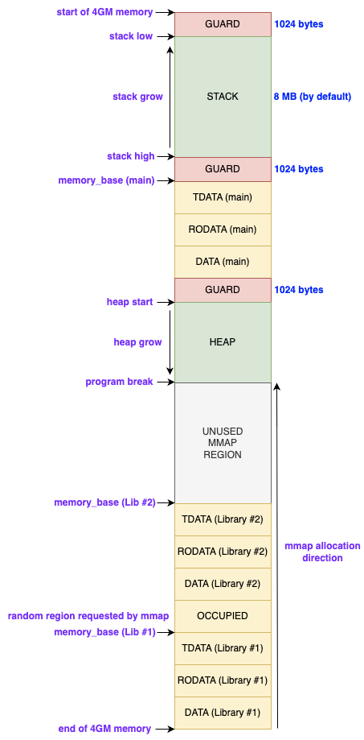

# Dynamic Linking and Dynamic Loading in wasmtime

## Overview

### Dynamic Linking
**Dynamic linking** refers to the process of loading the dependent libraries that an application needs at runtime, as opposed to linking them statically when the application is compiled. 


If a C program invokes `printf()`, in case of static linking, when the program is compiled and linked, the code corresponding to `printf` is a part of the final program executable and hence when the program runs, there is nothing to be explicitly loaded or resolved.

While in case of dynamically linked program, when the program is compiled and linked, the call to `printf` is left as unresolved and also the final program executable only contains the code and data of the program. The dependent libraries that this program depends on is added to the metadata of the binary. When the program is run, at the beginning, the dynamic linker is given control and it determines the paths of all dependent libraries and loads them to the memory as well as resolve all references to data and code to these libraries.

### Why Use Dynamic Linking
1. It reduces memory and storage footprints by loading shared libraries at runtime. Multiple programs can share the exact same library in memory, eliminating code duplication across binaries.

2. It allows shared libraries to be updated or patched for security without requiring the applications to be recompiled, provided the application binary interface (ABI) remains compatible.


### Dynamic loading
**Dynamic loading** refers to the loading of dependent libraries on the fly only when the application explicitly requests them (eg., via `dlopen()`) and resolving the symbols using `dlsym`


### Why Use Dynamic Loading
It enables applications to load optional components, plugins, or backends at runtime based on configuration or environment, making it possible to extend functionality without modifying the core executable. This supports modular and extensible system design of applications.

**In a traditional Linux system, both of these responsibilities are managed by the dynamic linker/loader, `ld.so`.**


## Motivation for adding dynamic linking/loading in wasmtime

In case of Lind, we implement dynamic loading for wasmtime to support applications like scripting language interpreters (eg: python), web servers (Apache HTTP, Nginx) that load modules at runtime using `dlopen/dlsym`. Additionally, we also extend wasmtime to support dynamic linking so as to reduce the memory footprint of our webassembly binaries and to eliminate the overhead of recompiling entire applications whenever underlying libraries are updated.


## The Linux Native Execution Model

When a program is executed on Linux, the kernel creates a new process image using `execve()` and maps the ELF executable into the process’s virtual address space. For statically linked binaries, the kernel sets up the stack and auxiliary data structures, then transfers control directly to the program’s entry point.

For dynamically linked binaries, the execution model splits responsibilities: the trusted kernel handles the initial loading, but dynamic loading is managed in user space. The ELF header contains a `PT_INTERP` segment specifying an external dynamic loader (typically `/lib64/ld-linux-x86-64.so.2`). The kernel maps this loader into the same process and transfers control to it. The loader then pulls in required shared libraries, resolves symbols, and performs relocations before finally jumping to the program's entry point. Crucially, this dynamic loader operates entirely within the untrusted user-space environment, sharing the same virtual address space as the main executable.

## Design Decisions

Unlike traditional Linux systems that rely on a standalone dynamic linker/loader (like `ld.so`), we have extended the wasmtime WebAssembly runtime to handle dynamic loading internally. We chose this design strategy for the following reasons.

Beyond determining paths and loading dependent libraries into memory, a primary responsibility of a dynamic linker/loader is resolving symbol references - mapping the program's imported functions and data to the correct memory addresses (exports) within the external modules. To accomplish this, the loader must have the privilege to read and modify the memory of both the executing program and the loaded libraries. In Linux, this is achieved by mapping the dynamic loader and the shared libraries into the same virtual address space as the executing process.

WebAssembly (WASM) binaries, however, operate under a different paradigm. They run inside a trusted host runtime (such as Wasmtime) that parses and validates the module, JIT-compiles the code, and instantiates it by allocating a contiguous, sandboxed linear memory region. WASM modules do not rely on OS-level virtual memory mapping. Instead, execution, memory management, and boundary mediation are handled entirely by the runtime to enforce strict isolation and memory safety.

Because the WebAssembly runtime already maintains absolute, privileged control over module memory, function tables, and instantiation state, extending the runtime itself to handle dynamic loading is the most secure and natural fit.

## Current Implementation Status
We have implemented dynamic loading support in Wasmtime. For applications that are compiled as dynamically linked executables or shared libraries, we are able to support both capabilities below:

1. Launch the application while injecting all required dependent libraries using the `--preload` option (similar to `LD_PRELOAD`).
2. Ensure that `dlopen()`, `dlsym()`, and `dlclose()` are properly resolved at runtime and corresponding libraries loaded.

	  
## Additional Features to be added:
1. Support for fork, threads, and signals within the shared libraries.
2. As of now, the dependent libraries have to be explicitly specified using `--preload` option. The compiler (`clang`) is supposed to add metadata about the required libraries when `--shared` or `-fPIC` option is used. Currently this is not working. This has to be fixed so that compiled adds the metadata and the dynamic loader can parse the metadata to determine the libraries required at runtime.

## Changes made to implement dynamic loading:

To execute WebAssembly applications within Lind, Wasmtime is modified to interface with RawPOSIX for handling system calls such as `mmap`. Specifically, the following changes were implemented in Wasmtime to support dynamic loading:


### Parsing the dynamic section 
The `dylink.0` custom section within WASM shared libraries is parsed to retrieve dynamic linking metadata. The `load_module` function is responsible for parsing the entire WASM binary to extract all section contents, including code, data, imports, exports, and dynamic linking information. As of now, `memory_size`, `memopry_alignment`, `table_size`, `table_alignment` and `importinfo` are parsed. We do not handle `needed` and `exportinfo` contents of `dylink.0`c section.


### Handling libraries passed via `--preload`

1. Allocate memory for the shared libraries by invoking `mmap` within RawPOSIX.
2. Apply relocations by invoking `__wasm_apply_data_relocs` and `__wasm_apply_tls_relocs`. These are functions hardcoded into the Wasm binary by `wasm-ld` during the `-shared` compilation phase.
3. Populate `LindGOT` with symbol addresses.
4. Resolve the final address for all functions (`GOT.func`) and data (`GOT.mem`) within the GOT table using the Wasmtime Linker.


### Memory Initialization and Instantiation (`instance.rs`)

Several low-level changes govern how Wasmtime allocates memory and recognizes module types during instantiation:

* **`init_vmmap()`**: Initializes memory at RawPOSIX before `mmap` is called.
* **System Memory Allocation**: During instantiation, Wasmtime interacts directly with RawPOSIX to allocate system memory for the module (part of the `init_vmmap` step).
* **`InstantiateType::InstantiateLib`  Instantiates dependent libraries


### Global Offset Table (`LindGOT`) and Linking (`linker.rs`)

`LindGOT` is Lind’s thread-safe Global Offset Table helper utilized for dynamic linking and late binding of symbols across separately-loaded Wasm modules.

* **Indirection Slots**: Instead of hard-wiring addresses, `LindGOT` maintains a concurrent-safe map from a symbol name (`String`) to a `u32` GOT slot. A value of `0` in the slot denotes an unresolved symbol.
* **Resolution Semantics**: Utilizes atomic reads/writes with a "first definition wins" approach. Conditional patching ensures a symbol is only updated if unresolved, preventing race conditions between multiple resolvers.
* **Linker Behavior**: The Wasmtime linker links imported functions to their actual targets. For dynamically linked binaries, compiler-assigned `.GOT.func` and `.GOT.mem` handles are utilized. The linker creates placeholder instances for libraries before they are fully instantiated, resolving final addresses once loaded into memory.


### Linear Memory Changes
For statically linked binary which has fixed addresses, the memory layout is fixed. Stack comes first, followed by data and heap. In dynamically linked binary, since the code is compiled as position-independent, the memory layout can be determined at runtime. The memory layout for current implementation is as follows:



### Handling `dlopen` and `dlsym`

In the Lind environment, standard dynamic linking calls from the guest's glibc (`dlopen`, `dlsym`, `dlclose`) are intercepted and forwarded to custom host functions within the Wasmtime runtime. This bridges the sandboxed WebAssembly execution with the trusted host's module management. `SymbolMap` acts as a per-library symbol namespace to model a dynamically loaded library’s exports and lifecycle state.


#### `dlopen` (Loading & Instantiation)
When invoked from the WebAssembly guest, the host implementation of `dlopen` performs the following steps:
* **Pointer Translation:** Translates the raw pointer provided by the guest (which is merely an offset into the Wasm linear memory) into a valid host-side string representing the library path.
* **Delegation:** Delegates the actual loading and instantiation to a `loader` callback injected by the runtime.
* **Execution:** The `loader` receives a mutable `Caller` (granting access to internal runtime state), the resolved library path, and the `dlopen` mode flags.
* **Returns:** On success, it returns an integer handle that uniquely identifies the loaded library instance.


#### `dlsym` (Symbol Resolution)
This host function is responsible for finding the memory address or function index of a requested symbol. Lind invokes `get_library_symbols()` to fetch the exact symbol address from the corresponding `SymbolMap` (using its handler) and executes it.
 It resolves the symbol name based on POSIX-style scope rules:
* **`RTLD_DEFAULT`:** Searches for the symbol across the global namespace.
* **Specific Handle:** Searches exclusively within the library identified by the provided integer handle.
* *Note: `RTLD_NEXT` (searching the next object in the load order) is currently unsupported.*
* **Returns:** The resolved symbol's value (e.g., a function index or memory address handle) so the Wasm guest can interact with it.

#### `dlclose` (Lifecycle Management)
This function manages the cleanup and unloading of libraries.
* **Reference Counting:** Decrements the reference count of the library identified by the provided `handle`. 
* **Unloading:** If the reference count reaches zero and the library is flagged as deletable (i.e., it was not loaded with `RTLD_NODELETE`), the host removes it from the global symbol table and frees associated resources.
* **Returns:** `0` on success, strictly adhering to POSIX-compatible conventions.


# Generating a WASM Binary for C/C++ applications

Programs written in higher-level programming languages like C, C++, or Rust can be compiled to WASM binaries. A `.wasm` file is a binary encoding of instructions for a virtual stack-based machine. It must be JIT compiled, AOT compiled, or interpreted.

A C/C++ program can be compiled using `clang` with a WebAssembly target to produce a WASM binary:

```bash
clang --target=wasm32-unknown-wasi --sysroot=$SYSROOT_FOLDER -O2 gcd.c -o gcd.wasm

```

1. **Preprocessing:** The C preprocessor handles macros and header expansion.
2. **Compilation (Frontend):** Clang parses C into LLVM IR.
3. **Code Generation (LLVM Backend):** Converts LLVM IR into WebAssembly instructions as a WebAssembly object file.
4. **Linking (`wasm-ld`):** The object file contains WebAssembly code with unresolved symbols. `wasm-ld` combines the object file with startup files and static libraries, pulling in required object files from the `sysroot/` directory. The linker merges all code, data, memory definitions, and imports into a single `.wasm` file.

## WASM Binary contents
A `.wasm` binary contains [1] [2] [3]: 
* **Magic Header:** Identifies the file as a WebAssembly binary.
* **Version number:** Specifies the WebAssembly binary format version.
* **Sections:** (Each section contains a section ID, size, and contents)
* **Type:** Defines functional signatures used in the module.
* **Import:** Declares functions, memories, tables, or globals provided by the host.
* **Function:** Lists the type indices of functions defined inside the module.
* **Memory:** Declares linear memory regions.
* **Global:** Stores internal global variable information.
* **Table:** Declares the indirect function call table.
* **Export:** Specifies entities visible to the host.
* **Start:** Identifies a function executed automatically upon instantiation.
* **Element:** Initializes table entries.
* **Code:** Contains local variable info and internal function bytecode.
* **Data:** Contains memory initialization information (index, starting position, initial data).


WebAssembly by default produces a single data section. However, when using clang/LLVM for C/C++, separate sections are allocated for different data types:

* `.data` (Initialized data)
* `.tdata` (Thread-related data)
* `.rodata` (Read-only data)


## Building a shared WASM library

A WebAssembly dynamic/shared library is a WebAssembly binary with a special custom section indicating it is a dynamic library, alongside additional loader information.

* **Compilation:** The `-fPIC` flag produces position-independent code whose final address is known only at runtime. Non-local symbols are accessed via `GOT.mem` and `GOT.func`.
* **Linking:** The `-shared` flag produces a shared library, while `-pie` produces a dynamically linked executable.

To generate a shared WASM library, use the following flags:

```bash
CFLAGS=-fPIC
LDFLAGS=-Wl,-shared 

```

Additional linker flags that can be used:

```bash
-Wl,--import-memory \
-Wl,--shared-memory \
-Wl,--export-dynamic \
-Wl,--experimental-pic \
-Wl,--unresolved-symbols=import-dynamic

```


## Metadata added by linker to the shared WASM binary

The generated shared WASM library binary will have a custom section called `dynlink.0` containing:

1. **`WASM_DYNLINK_MEM_INFO`**: Specifies memory and table space requirements.
2. **`WASM_DYLINK_NEEDED`**: Specifies external module dependencies.
3. **`WASM_DYLINK_EXPORT_INFO`**: Specifies export metadata.
4. **`WASM_DYLINK_IMPORT_INFO`**: Specifies import metadata.
5. **`WASM_DYLINK_RUNTIME_PATH`**: Specifies the runtime path (equivalent to `DT_RUNPATH` in ELF).

Additionally, `wasm-ld` adds `__wasm_apply_data_relocs` and `__wasm_apply_tls_relocs` to the final binary to handle relocation during instantiation.


# Running the .wasm file

This `.wasm` file must be interpreted, converted to native code, and run within a VM. The steps are:

1. **Read the file:** Load the `.wasm` file into memory.
2. **Parse structured sections:** Extract types, imports, functions, and memory.
3. **Validate the module:** Ensure type safety, structural correctness, and sandbox compliance.
4. **Compile to native code:** Wasmtime translates WebAssembly bytecode into native machine code.
5. **Create a Store and Link Imports:** A store is created to hold runtime state. Declared imports (e.g., WASI functions) are resolved to host implementations.
6. **Instantiate the Module:** Transform the static module into a live execution instance. This involves allocating linear memory, tables, and globals in the store, and linking runtime representations to their resolved imports.
7. **Initialize Memory and Tables:** Wasmtime copies data segments from the Data Section into linear memory at specified offsets. Element segments are used to initialize tables for indirect calls.
8. **Run the start function:** Execute the module's entry point.


# References
[1]: https://webassembly.github.io/spec/core/binary/modules.html
[2]:https://www.w3.org/TR/wasm-core-1/
[3]: https://coinexsmartchain.medium.com/wasm-introduction-part-1-binary-format-57895d851580
[4]:https://github.com/WebAssembly/tool-conventions/blob/main/DynamicLinking.md
[5]:https://github.com/WebAssembly/tool-conventions/blob/main/Linking.md
[6]:https://emscripten.org/docs/compiling/Dynamic-Linking.html
[7]:https://github.com/bytecodealliance/wasm-tools/blob/main/crates/wit-component/src/linking.rs
[8]:https://www.usenix.org/system/files/sec20-lehmann.pdf


