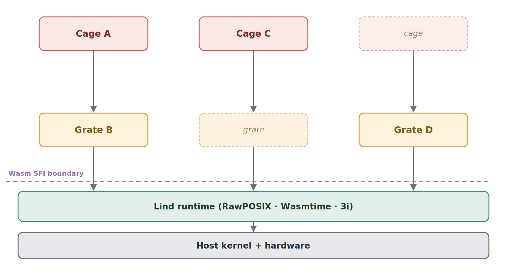

# Lind-Wasm Threat Model

## 1. Overview

Lind-Wasm runs multiple mutually untrusting programs, called *cages*, inside one
unprivileged Linux process. Two layers keep them apart:

1. **WebAssembly SFI.** Each cage runs in its own Wasmtime `Store` with its own
   linear memory, and every memory access is bounds-checked by JIT-emitted code.
   A cage cannot touch memory outside its own region no matter what it runs.
2. **RawPOSIX.** A user-space microvisor that handles every syscall a cage makes.
   A cage cannot issue a raw Linux syscall. Calls go `make_syscall()` → 3i →
   (grate stack) → RawPOSIX → kernel, and RawPOSIX checks each one before
   forwarding.

In between, **3i** routes a cage's syscalls through optional policy components
called *grates* before they reach RawPOSIX. Affecting the host or another cage
means defeating both layers.

## 2. Methodology

We do not sort components into trusted and untrusted, because that hides the fact
that a grate is trusted by the cages it isolates and by nothing else. Instead we
ask:

- What are the actors?
- What is isolated from what?
- For each attacker position, what can it do to each other actor?

We also do not assume the components we rely on are bug-free. For each one we
state what a bug in it would cost. A bug in RawPOSIX and a bug in the host kernel
are both bad, but their blast radius is not the same.

## 3. Actors

The instructive topology is small:

*Figure 1. Color marks trust position: red cages (untrusted), amber grates
(untrusted), green the Lind runtime and TCB, slate the kernel and hardware. The
dashed line is the Wasm SFI boundary, guest above and host below. Cage A routes
through Grate B, its ancestor grate. Cage C and Grate D each sit in their own
separate stack, with their partner boxes drawn lighter, unrelated to A and B and
to each other. RawPOSIX, Wasmtime, and 3i form one band because nothing isolates
them, and the paper's convention puts them at the bottom.*

| Actor | Role in the model |
| --- | --- |
| **Cage A** | The reference application cage. Fully adversarial. |
| **Grate B** | The ancestor grate of Cage A. Mediates Cage A's syscalls. |
| **Cage C** | An unrelated cage. No routing relationship to A or B. |
| **Grate D** | An unrelated grate. No routing relationship to anything in A's stack. |
| **RawPOSIX + Wasmtime + 3i** | The Lind runtime (TCB). One actor because the three share fate (Section 4). |
| **Host kernel + hardware** | The bottom of the trust stack. |

Grates are themselves cages under the same SFI. Cage versus grate is a question
of position in the stack, not of isolation mechanism.

## 4. Trust relationships

Stated as isolation rather than a label:

- **Host kernel + hardware.** Assumed correct. Out of scope to defend.
- **Lind runtime (Wasmtime + 3i + RawPOSIX).** The TCB. All three are host Rust
  code outside any sandbox, with no isolation between them, so a bug in one is a
  bug in all. Their state (handler tables, per-cage vmmap, fdtables, signals) is
  host memory the guest cannot address. Compromise it and the attacker owns every
  cage and grate, still capped at the unprivileged-process ceiling (Section 7,
  Case 4).
- **Grates.** Untrusted code under the same SFI as a cage, never in the TCB. A
  grate is trusted only by its own descendant cages, and only to enforce their
  policy. See below.
- **Application cages.** Untrusted and fully adversarial, buggy or malicious.

### TCB versus trusted policy surface

The TCB is the set of components that break the system's guarantees if
compromised. It is fixed across deployments and small enough to analyze.

The trusted policy surface is the grates that must be correct for a *given*
deployment's policy to hold. A bad grate can subvert the policy on the cages it
mediates: skip a namespace check, leak data it pulled via
`copy_data_between_cages`, or fake a return value instead of doing the call. It
still cannot touch the TCB, the host, or unrelated cages.

So a deployment audits two things separately. The TCB once, and each grate on its
own. Grates are small and single-purpose, so one can be checked without reading
the others.

## 5. Attacker model

### Compromised cage

The attacker fully controls one or more cages and can:

- Run arbitrary Wasm, including exploits against bugs in its own linear memory.
- Read and write any byte of its own linear memory.
- Call any host import with chosen arguments, including `register_handler`,
  `make_syscall`, and `copy_handler_table_to_cage`, subject to 3i's interposition
  and scoping.
- Call the syscall API with arbitrary inputs.
- Rewrite its own handler table, try to copy in a different one, or try to drive
  3i operations against peer or ancestor cages (scoping denies these).

It cannot, by the Wasm memory model rather than any policy check, address host
memory, issue raw Linux syscalls, alter JIT output, or reach another cage's
memory.

Out of the attacker's control: the kernel and hardware, the Wasmtime JIT and its
output, the 3i logic and handler tables, RawPOSIX state, and other cages' memory.

### Compromised grate

A grate that is compromised can observe, change, drop, or fake results for any
syscall it mediates, for the cages below it. It cannot read or write cages that
do not route through it (except through `copy_data_between_cages`), corrupt
RawPOSIX, the handler tables, or the runtime, or reach cages above it or beside
it. It runs under the same SFI as any cage. Its reach is the set of cages it
mediates and the 3i API, which is the same API any cage has.

## 6. The matrix

Columns are the **attacker**, rows the **victim**. Each cell is what the attacker
can do to the victim.

| Victim \ Attacker | Cage A | Grate B | Cage C | Grate D | Runtime | Kernel+HW |
| --- | --- | --- | --- | --- | --- | --- |
| **Cage A** | N/A | CC | RE | RE | KO | KO |
| **Grate B** | FE | N/A | RE | RE | KO | KO |
| **Cage C** | RE | RE | N/A | RE | KO | KO |
| **Grate D** | RE | RE | RE | N/A | KO | KO |
| **Runtime** (RawPOSIX/Wasmtime/3i) | U | U | U | U | N/A | KO |
| **Kernel + HW** | U | U | U | U | U | N/A |

Legend:

- **CC** Complete control: read and write the victim's memory, rewrite its
  syscalls, change its policy.
- **FE** Denial of service on the grate, plus a direct input channel into it. The
  cage can flood the grate that mediates it and hand it malformed calls. Against a
  correct grate this is only DoS: memory isolation holds and nothing is
  compromised. It differs from RE because the cage routes through this grate, so
  this is the one place a grate's code takes cage-controlled input directly, where
  a grate bug would surface (Case 2).
- **RE** Resource exhaustion and performance interference. Memory isolation holds.
- **KO** Complete compromise, capped at the unprivileged-process ceiling
  (Section 7).
- **U** Unaffected. No path from attacker to victim.
- **N/A** Same actor.

## 7. Cell reasoning

Six cases cover the whole matrix.

**Case 1: ancestor grate against its descendant cage (CC).** Grate B mediates
Cage A, so a compromised Grate B controls Cage A completely: read and write its
memory, rewrite its syscalls (`open` of A becomes `open` of B, `fork` becomes
`exit`), change its policy. This is a grate's normal authority over the cages it
mediates, turned hostile, and it is still capped at the unprivileged-process
ceiling (Case 4).

**Case 2: descendant cage against its ancestor grate (FE).** Cage A's calls run
through Grate B, so it has reach an outsider does not. It can flood Grate B
through 3i and feed it crafted calls hoping to trip a bug in the grate. Against a
correct grate this amounts to denial of service and nothing more: memory
isolation holds and the grate is not taken over. A buggy grate is the exception,
since this is the one place a cage's input reaches a grate's code directly. That
direct channel is what separates FE from RE, where an unrelated cage has no path
to the grate at all.

Isolation holds here because of how pointer arguments cross the boundary. A
pointer a cage hands to a grate is never dereferenced blind. Either it travels
down tagged with its originating cage and RawPOSIX faults if it falls outside
that cage's address space, or the grate pulls the bytes in with the
copy-from-cage call, which checks the same provenance before copying. A cage
cannot turn a bad pointer into a memory-safety bug in a grate.

**Case 3: any unrelated pair (RE).** Two parties with no routing relationship, in
either direction, can only compete for shared resources: CPU, file descriptors,
and the like. Memory isolation holds, and neither can read the other's memory or
touch its policy.

**Case 4: the runtime as attacker (KO).** A memory-safety bug in Wasmtime, 3i, or
RawPOSIX that an attacker rides into the runtime compromises every cage and grate
(the three share fate, Section 4). Even then the attacker is just an unprivileged
Linux process. Nothing Lind adds sits in the kernel or hardware, so the worst its
own code can cost you is whatever an unprivileged process can do. That ceiling is
the main resilience argument for the design.

**Case 5: cage or grate against the runtime or kernel (U).** Neither has a path
downward. The runtime's state is host memory it cannot address (Section 4), and
the only way up is a runtime bug, which is Case 4. So these cells are unaffected.

**Case 6: kernel or hardware compromised (KO, out of scope).** If either falls,
everything is lost and Lind cannot prevent it. It sits in the matrix only to keep
the assumption visible.

## 8. Security properties

**P1: cross-cage memory isolation.** No cage can read or write another cage's
linear memory. Each cage's memory is a separate mapped region, and every load and
store is bounds-checked by JIT code against that cage's own `VMMemoryDefinition`.
This holds against arbitrary hostile code.

**P2: syscall mediation.** No cage issues a raw Linux syscall. Everything goes
`make_syscall()` → 3i → grate stack → RawPOSIX → kernel, and RawPOSIX validates
pointer arguments against the calling cage's vmmap before forwarding.

**P3: directional confinement.** Syscalls run through the grate stack toward
RawPOSIX, and a cage cannot reach past, around, or below the grates that mediate
it.

**P4: handler-table integrity.** The 3i logic and per-cage handler tables are
host memory, unreachable from any cage (Section 4), so routing cannot be tampered
with even if the 3i policy logic has a bug. A cage influences routing only
through the declared 3i import API, which is itself open to ancestor-grate
interposition.

**P5: fork inheritance.** A forked child inherits its parent's handler table
through `copy_handler_table_to_cage`, so a confined cage cannot spawn a child that
escapes its policy. An ancestor grate can intercept the fork to constrain the
child further.

**P6: control-flow integrity.** Wasm's structured bytecode rules out arbitrary
native jumps, indirect calls are type-checked and table-bounded, and return
addresses live on Wasmtime's native stack rather than in cage-addressable memory,
so a cage's loads and stores cannot reach them. RawPOSIX also refuses
`PROT_EXEC` on any `mmap` or `mprotect` that also asks for `PROT_WRITE`, closing
the one legitimate path to a writable-executable region a cage could run injected
code from.

### How 3i enforces P3

Three properties of 3i close three different escapes:

1. **Handler changes are interposable.** `register_handler` and
   `copy_handler_table_to_cage` go through 3i themselves, so an ancestor grate can
   see and deny a cage's attempt to rewrite the routing over it. A cage cannot
   quietly change the rules it runs under.
2. **3i operations are scoped to descendants.** A grate can act only on cages
   below it, never a parent, sibling, or stranger. 3i enforces this in host code,
   so it holds even if a compromised grate learns another cage's ID.
3. **Dispatch itself is not interposable.** `make_syscall`, the primitive
   everything else builds on, runs in trusted host code and cannot be hijacked.
   Interposition changes what a handler does, not which handler runs.

## 9. Out of scope

Not addressed here:

- **Speculative execution and other microarchitectural side channels.**
- **Memory safety inside a cage.** Corruption confined to a cage's own memory
  breaks no cross-cage guarantee. We lean on the underlying SFI model for in-cage
  safety and do not reprove it.
- **Wasmtime correctness.** The JIT and its output are assumed correct, and P1
  and P6 rest on this.
- **Compiler and glibc correctness.**

### Resource exhaustion

Resource exhaustion is **modeled but not mitigated**: it is the residual in every
cross-party cell of the matrix. The claim is only that isolation and policy
confinement survive it. Fair sharing of CPU, file descriptors, and the like
across cages is future work, not a current property.
