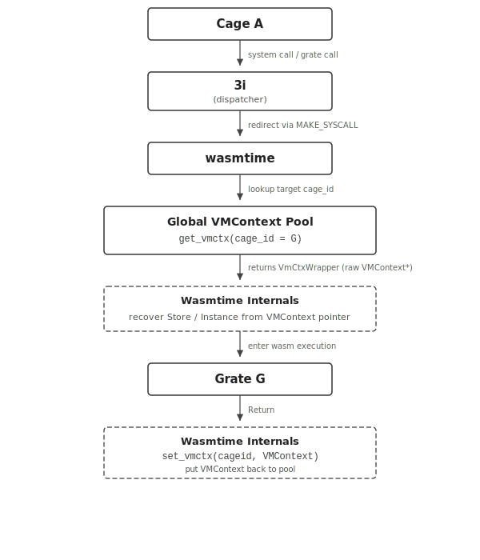

# Lind and Wasmtime

## What is Wasmtime?

Wasmtime is a standalone JIT-style runtime for WebAssembly, designed for use with WebAssembly System Interface (WASI) and other WASI-inspired environments. It is part of the Bytecode Alliance, an open-source effort to create secure software foundations.

Wasmtime can run WebAssembly modules that follow the WASI standard, providing a robust and efficient environment for running WebAssembly outside of the browser.

## Getting Started with Wasmtime

To get started with Wasmtime, you can download and install it from the [official Wasmtime releases](https://github.com/bytecodealliance/wasmtime/releases) page. Follow the installation instructions specific to your operating system.

---

## Prototype Implementation - Lind-Wasm

[todo]
- figure

### Background - Wasmtime

#### Store

In Wasmtime, a `Store` is the top-level container that owns all runtime objects. A single `Store` may own multiple `Instance`s, and every `Instance` must belong to exactly one `Store`. All runtime items, such as Functions, Tables, Memories, and Globals, are allocated within the `Store` and are tied to its lifetime.

#### Module & Instance

- A `Module` is only a compiled binary: it contains code and type information but no runtime state.
- An `Instance` is the executable instantiation of a `Module` within a `Store`.

You cannot read memory, table, globals, or call functions on a `Module`. All executable interactions happen through an `Instance`.

#### VMContext

Each `Instance` has an internal data structure called `VMContext`. `VMContext` is a raw pointer used by the JIT-generated machine code. This has information about globals, memories, tables, and other runtime state associated with the current instance.

#### Call Stack

Although WebAssembly defines an abstract operand stack and structured control flow, Wasmtime lowers all function calls and stack frames to the native call stack of the executing host thread. Each Wasm function is compiled into a normal machine function that receives a `VMContext` pointer as an implicit first argument. Local variables, temporaries, and control-flow state are therefore represented using standard native stack slots and registers.

Wasmtime attaches a `VMRuntimeLimits` structure to every `VMContext`, which stores a stack-limit pointer. At function-entry, compiled code inserts a prologue check comparing the current native stack pointer against this limit; exceeding it triggers a Wasmtime stack-overflow trap rather than a process-level segmentation fault.

#### Memory

Wasmtime implements each linear memory as a sandboxed region in the host virtual address space. At instantiation time, the runtime reserves a contiguous virtual range using `mmap` and commits only the portion required by the module’s initial size.

Each memory is represented internally by a `VMMemoryDefinition` structure embedded in the instance’s `VMContext`. The `VMContext` is passed as an implicit argument to all JIT-compiled functions. Every load or store instruction is lowered to native code that first reads the memory’s base pointer and current length from the `VMContext`, performs an explicit bounds check, and then translates the Wasm address into a native pointer (`base + offset`).

---

### Implementation


Lind-wasm implements a global runtime-state lookup and pooling mechanism for lind-wasm and lind-3i, enabling explicit, controlled transfers of execution across cages, grates, and threads.

Unlike conventional WebAssembly execution models, where control flow is confined to a single Wasmtime `Store`, `Instance`, and linear call stack, Lind-wasm supports cross-instance and cross-module execution transfers. These transfers are required to implement POSIX-like process semantics (each process has its own state management) and lind-3i’s inter-cage and inter-grate call model.

To support this, lind-wasm must be able to:

- Identify the correct Wasmtime runtime state without relying on implicit “current execution context” assumptions
- Re-enter an existing Wasm instance from outside its original call stack
- Support concurrent execution paths that operate on shared Wasm linear memory

---

### Execution Scenarios Requiring Runtime Lookup

#### 1. Process-like Operations (`fork`, `exec`, `exit`)

Operations such as fork, exec, and exit require Wasmtime instances to be created, cloned, or destroyed. However, the logic that performs the semantic handling of these operations may execute in a different cage or grate than the one that originally issued the system call.

After RawPOSIX completes the semantic work, control must return to Wasmtime, not necessarily to the instance that initiated the call.
As a result, lind-3i cannot rely on an implicit “current” runtime state. Instead, it must explicitly retrieve the correct execution context:

For `fork`, `exec`, and `exit`, these operations conceptually create, replace, or terminate the execution state of a process. After RawPOSIX completes the semantic handling, lind-wasm must resume execution in a Wasmtime instance associated with an *arbitrary* `cage_id`, which may differ from the calling cage. The appropriate runtime context is therefore retrieved by directly looking up the execution context associated with the target `cage_id`.

#### 2. Thread-like Operations

Thread operations introduce additional execution contexts within the same cage. These contexts are not part of the main execution flow and cannot be recovered via a global “current” state. Instead, lind-wasm explicitly looks up the runtime context associated with the corresponding `(cage_id, tid)` pair, ensuring correct control-flow transfer during thread creation, scheduling, and termination.

#### 3. Grate Calls (Cross-Module Execution Transfers)

Grate calls represent explicit execution jumps between Wasm modules, such as:

- Cage → Grate
- Grate → RawPOSIX
- Grate → Grate

These jumps are not standard Wasm function calls and cannot rely on a shared call stack or `Store`. Supporting them requires the ability to (1) locate a runtime state belonging to a different module, and (2) re-enter Wasm execution from outside the original stack frame.

To achieve this, lind-wasm relies on the following invariant: each Wasmtime `Store` contains exactly one Wasm `Instance`, and each thread executes within its own independent `Store` / `Instance` pair. The Wasmtime `VMContext` pointer uniquely identifies the execution state of a running instance. Given a valid `VMContext`, lind-wasm can recover the associated `Store` and `Instance` using Wasmtime internals. Moreover, since `VMContext` is the raw pointer, it also helps lind-wasm bypass the lifetime restriction of `Store` and `Instance`.

---

### Data structure

Because `VMContext` is opaque and lifetime-managed internally by Wasmtime, this module stores it as a raw pointer wrapped in a minimal abstraction:

```rust
pub struct VmCtxWrapper {
    pub vmctx: NonNull<c_void>,
}
```

Lind-Wasm maintains two global, per-cage pools of `VMContext` pointers:

#### 1. General execution context lookup table

The global `VMCTX_QUEUES` structure primarily manages execution contexts for the *main thread* (`tid = 1`) of each cage and indexed by `cage_id`. Each cage owns a FIFO queue that stores the execution contexts currently available to it. The total number of cages is fixed at startup (`MAX_CAGEID`).

Importantly, table slots are never removed from the global pool. Instead, the *slot contents (the queue)* of each slot may be inserted or removed over time. When a cage terminates, its corresponding queue slot remains present, but its slot content is cleared and set to `None`.

This design ensures that each table index always directly corresponds to a `cage_id`, eliminating the need for dynamic index management or lookup structures. As a result, `cage_id` can be used as a stable, constant-time index into the pool, reducing lookup overhead and avoiding additional search or indirection costs.

```rust
static VMCTX_QUEUES: OnceLock<Vec<Mutex<VecDeque<VmCtxWrapper>>>>;
```

#### 2. Thread handling and execution context lookup

To support thread-related operations, lind-wasm maintains a separate, thread-specific execution context table. This table is used *only* for non-main threads (`tid != 1`) and exists to support thread-related syscalls and thread `exit`. Each `(cage_id, tid)` maps to at most one `VMContext`. No pooling is performed. This table is not consulted for normal execution or grate calls.

```rust
static VMCTX_THREADS: OnceLock<Vec<Mutex<HashMap<u64, VmCtxWrapper>>>>;
```

---

### Execution Flow



**Callback Definition (Wasmtime side):**

The C-ABI callback function knows how to re-enter the Wasm module via the unified entry function.

**Handler Registration:**

When the Wasm module calls `register_handler()`, the redirection information entry is extracted and passed to 3i.

**Cross-Cage Invocation:**

When a syscall from cage A is routed to grate B:

1. the regular syscall reaches 3i via `make_syscall`
2. 3i looks up the `cageid` entry for B, and lookup corresponding runtime function pointer for `cageid`
3. 3i directly invokes the function pointer, re-entering the target Wasm instance through Wasmtime’s runtime context.

**Dispatch Inside Grate:**

The Wasm entry function (in module) receives a pointer identifying the target handler and dispatches control to the correct per-syscall implementation.