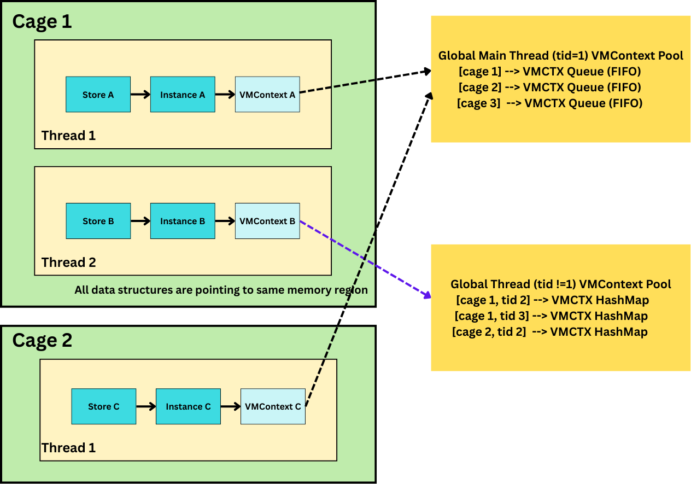

# Lind and Wasmtime

## What is Wasmtime?

Wasmtime is a standalone JIT-style runtime for WebAssembly, designed for use with WebAssembly System Interface (WASI) and other WASI-inspired environments. It is part of the Bytecode Alliance, an open-source effort to create secure software foundations.

Wasmtime can run WebAssembly modules that follow the WASI standard, providing a robust and efficient environment for running WebAssembly outside of the browser.

## Getting Started with Wasmtime

To get started with Wasmtime, you can download and install it from the [official Wasmtime releases](https://github.com/bytecodealliance/wasmtime/releases) page. Follow the installation instructions specific to your operating system.

## Prototype Implementation - Lind-Wasm

[todo]
- figure

### Background - Wasmtime

#### Store

In Wasmtime, a `Store` is the top-level container that owns all runtime objects. A single `Store` may own multiple `Instance`s, and every `Instance` must belong to exactly one `Store`. All runtime items, such as Functions, Tables, Memories, and Globals, are allocated within the `Store` and are tied to its lifetime.

#### Module & Instance

- A `Module` is only a compiled binary: it contains code and type information but no runtime state.
- An `Instance` is the executable instantiation of a `Module` within a `Store`.

You cannot read memory, table, globals, or call functions on a `Module`. All executable interactions happen through an `Instance`.

#### VMContext

Each `Instance` has an internal data structure called `VMContext`. `VMContext` is a raw pointer used by the JIT-generated machine code. This has information about globals, memories, tables, and other runtime state associated with the current instance.

#### Call Stack

Although WebAssembly defines an abstract operand stack and structured control flow, Wasmtime lowers all function calls and stack frames to the native call stack of the executing host thread. Each Wasm function is compiled into a normal machine function that receives a `VMContext` pointer as an implicit first argument. Local variables, temporaries, and control-flow state are therefore represented using standard native stack slots and registers.

Wasmtime attaches a `VMRuntimeLimits` structure to every `VMContext`, which stores a stack-limit pointer. At function-entry, compiled code inserts a prologue check comparing the current native stack pointer against this limit; exceeding it triggers a Wasmtime stack-overflow trap rather than a process-level segmentation fault.

#### Memory

Wasmtime implements each linear memory as a sandboxed region in the host virtual address space. At instantiation time, the runtime reserves a contiguous virtual range using `mmap` and commits only the portion required by the module’s initial size.

Each memory is represented internally by a `VMMemoryDefinition` structure embedded in the instance’s `VMContext`. The `VMContext` is passed as an implicit argument to all JIT-compiled functions. Every load or store instruction is lowered to native code that first reads the memory’s base pointer and current length from the `VMContext`, performs an explicit bounds check, and then translates the Wasm address into a native pointer (`base + offset`).

#### Implementation



This module provides a runtime-state lookup and execution-transfer mechanism for lind-wasm and lind-3i, enabling controlled transfers of execution across cages and grates.

Unlike a conventional WebAssembly execution model, where control flow stays inside one Wasmtime `Store`, one `Instance`, and one linear call stack, lind-wasm must sometimes re-enter Wasmtime module from outside the currently executing module or continuation. However, not all such re-entries are equivalent.

Some operations must resume execution in the **same continuation context** that originally issued the call. Others only need a **compatible execution context** for the target grate. The implementation therefore distinguishes these cases explicitly rather than treating all runtime lookup as one uniform mechanism.

### Execution Scenarios Requiring Runtime Lookup

#### 1. Process-like operations (`fork`, `exec`, `exit`, `pthread`)

The first scenario occurs during process-like operations such as `fork`, `exec`, and `exit`. These operations create, clone, replace, or terminate Wasm process state. Their semantic handling is performed in RawPOSIX, and the code that performs that handling is not necessarily running in the same cage or grate that originally issued the syscall.

After RawPOSIX completes the semantic work, execution must return into Wasmtime so that Wasm code can continue. At that point, lind-wasm cannot rely on any implicit “current” (the caller is RawPOSIX when transferring control from RawPOSIX to Wasmtime) runtime state. Instead, it must explicitly recover the execution context associated with the original caller's `(cage_id, tid)`.

These operations are **continuation-sensitive**. In particular, `fork` and `exit` rely on Asyncify’s paired unwind/rewind transitions such as `start_unwind` / `stop_unwind` and `start_rewind` / `stop_rewind`. Those transitions must occur in the **same Wasmtime instance and asyncify state** that originally issued the syscall. Resuming in a different instance, even if it shares the same linear memory, breaks that invariant and may lead to incorrect callback behavior or wrong return values.

Therefore, process-like operations must resume in the **active execution context** corresponding to the original `(cage_id, tid)`.

#### 2. Grate calls (cross-module execution transfers)

The second major runtime-transfer scenario arises during grate calls. A grate call transfers control from one Wasm module to another, for example from a cage into a grate or between grates.

Unlike `clone`, `exec`, and `exit`, grate calls are **not continuation-sensitive**. A grate call does **not** need to resume execution in the exact Wasmtime instance that originally initiated the transfer. Instead, it only needs to enter a **compatible execution context** for the target grate.

In the current implementation, that compatible context is represented not by a single shared runtime state, but by a **worker pool** managed per grate. Each worker owns:

- its own Wasmtime `Store`
- its own instantiated grate `Instance`
- all works with same grateid are attached by same linear memory
- its own independent Wasm call stack region inside the shared linear memory

Operationally, a grate call is executed by leasing one available worker from the target grate’s `GrateHandler`, invoking the grate entry trampoline (`pass_fptr_to_wt`) inside that worker, and returning the worker to the pool after the call completes.

### Why grate calls use workers instead of continuation lookup

A Wasmtime `Store` is an execution boundary: it owns the execution-local runtime state associated with one instance execution, including call stack state and other mutable runtime-local state.

By giving each grate worker its own `Store` and `Instance`, lind-wasm ensures that concurrent grate calls do not run inside the same Wasmtime runtime context. As a result:

- parallel grate calls do not contend on one shared Wasm call stack
- they do not overwrite one another’s instance-local execution state
- they do not require Asyncify continuation matching

### Data structures

#### `VmCtxWrapper`

For continuation-sensitive operations, lind-wasm stores Wasmtime runtime context pointers in a lightweight wrapper:

```rust
pub struct VmCtxWrapper {
    pub vmctx: NonNull<c_void>,
}
```

`VMContext` is opaque and lifetime-managed internally by Wasmtime, so the implementation stores it as a raw pointer wrapper and uses it only where exact active-context recovery is required.

#### Per-thread active context table

The current implementation maintains a per-cage, per-thread table of active `VMContexts`:

```rust
static VMCTX_THREADS: OnceLock<Vec<Mutex<HashMap<u64, VmCtxWrapper>>>>;
```

This table stores the currently active execution context for each thread and is used exclusively for continuation-sensitive operations, especially pthread-related syscalls and thread exit. Each `(cage_id, tid)` maps to at most one active `VMContext`. 

#### Grate worker template

Reusable grate workers are created from a shared per-grate template:

```rust
pub struct GrateTemplate<T> {
    pub engine: Engine,
    pub module: Module,
    pub linker: Linker<T>,
}
```

#### Grate request

Each grate submission is marshalled into a request object:

```rust
pub struct GrateRequest {
    pub handler_addr: u64,
    pub cageid: u64,
    pub arg1: u64,
    pub arg1cageid: u64,
    pub arg2: u64,
    pub arg2cageid: u64,
    pub arg3: u64,
    pub arg3cageid: u64,
    pub arg4: u64,
    pub arg4cageid: u64,
    pub arg5: u64,
    pub arg5cageid: u64,
    pub arg6: u64,
    pub arg6cageid: u64,
}
```

A GrateRequest represents one cross-module execution transfer. It includes the target handler address, the calling cage identity, and up to six `(value, cageid)` pairs so the callee can interpret pointer-like arguments in the correct ownership / address-space context.

#### Grate handler and worker pool

Each grate owns a `GrateHandler<T>`, which manages a reusable pool of workers and defines how incoming grate calls are scheduled.The handler supports two concurrency policies:

```rust
pub enum ConcurrencyMode {
    Parallel,
    Serialized,
}
```

- Parallel: multiple calls may execute concurrently as long as different workers are available
- Serialized: callers may submit concurrently, but only one call is allowed to enter the grate at a time

Workers are leased for the duration of one call and automatically returned to the pool afterward.

### Worker-local stack isolation

Although different grate workers execute in different Wasmtime `Store`s and `Instance`s, they may still attach to the same underlying linear memory region. For that reason, workers must not share the same stack range in linear memory.

Lind-wasm addresses this by partitioning the grate stack arena into per-worker stack slots. Each worker is assigned:

- a `stack_base`
- a `stack_top`

Before every grate call, the worker resets its `__stack_pointer` to the top of its private slot. This ensures that each call begins from a clean stack state inside that worker’s dedicated stack region.

Conceptually, this gives each worker:

- independent Wasmtime execution state at the `Store` / `Instance` level
- independent stack space inside the shared linear memory arena

Together, those properties preserve isolation for concurrent grate execution.

### Execution flow

To support intercage interposition without modifying the kernel or Wasmtime itself, lind-3i provides a user-space dispatch layer that allows system calls and other calls to be redirected across cages and grates.

The following execution flow illustrates the overall dispatch model:

(todo: add figure)

#### Callback definition

On the Wasmtime side, the exported entry trampoline knows how to re-enter the Wasm module and dispatch to the correct target handler.

#### Handler registration

When a Wasm module registers a handler, the redirection metadata is recorded so that lind-3i can later route incoming requests to the correct target grate.

#### Cross-cage / cross-grate invocation

When a call from cage A is routed to grate B:

- the request reaches 3i through the normal dispatch path
- 3i send the request to Wasmtime callback function according to information registered in the table
- [`wasmtime/lind-3i`] resolves the target grate handler for B
- the target `GrateHandler` leases an available worker
- the request is executed inside that worker by invoking the grate entry trampoline (`pass_fptr_func`)
- when the call finishes, the worker is returned to the pool

#### Dispatch inside the grate

Inside the target worker, the Wasm entry function receives the marshalled handler address and arguments, then dispatches to the appropriate grate-side implementation.
