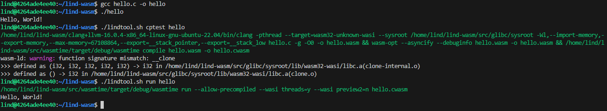
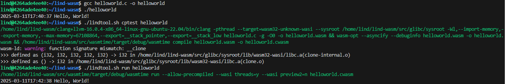

# Examples of Compiling and Running

## Hello, World!
To begin, a simple "Hello World" file can be created.  In this case, as follows:
```c
#include <stdio.h>

int main() {
    printf("Hello, World!\n");
    return 0;
}

```
First, it can be compiled and run as usual with native gcc:
```bash
gcc hello.c -o hello
./hello
```

Then under lind, where it should produce the same output:
```
./scripts/lindtool.sh cptest hello
./scripts/lindtool.sh run hello
```
<!-- A sample output is shown below:
<a href="../../images/hello_screenshot1.png" target="_blank">
  
</a> -->

## Example with Header file included

Header files can be included in the same way.  Below is a simplified example:
#### `print_it.h`:
```
#ifndef PRINT_IT_H
#define PRINT_IT_H

#include <stdio.h>
#include <time.h>

static inline void print_it(const char *message) {    
    time_t now = time(NULL);
    struct tm *t = localtime(&now);char timestamp[20];
    strftime(timestamp, sizeof(timestamp), "%Y-%m-%dT%H:%M:%S", t);
    printf("%s %s\n", timestamp, message);
}

#endif
```
#### `helloworld.c`:
```c
#include "print_it.h"

int main() {
    print_it("Hello, World!");
    return 0;
}

```
Again, it can be compiled and run as usual with native gcc:
```bash
gcc helloworld.c -o helloworld
./helloworld
```

Then under lind, where it should produce the same output:
```
./lindtool.sh cptest helloworld
./lindtool.sh run helloworld
```
<!-- A sample output is shown below:
<a href="../../images/hello_screenshot2.png" target="_blank">
  
</a> -->